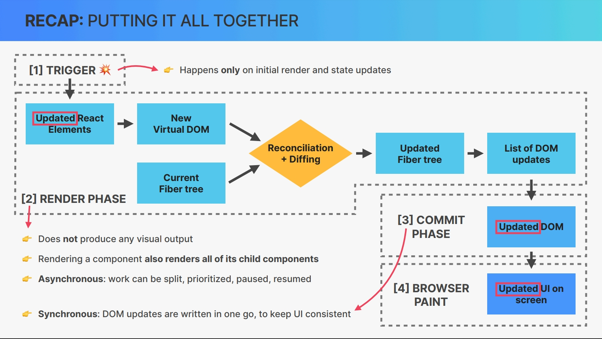

## Practical guidelines about state

- Use a state variable for data **that will change at some point**
- Want something in the component to be **dynamic**
  Example: A modal window can be open or closed
- Want to change the way a component looks, or the data it displays, **update its state**.
- For data that should not trigger component re-renders.**don't use state**.

## Think in React

### Process

1. Break the UI into components
2. Build the static version
3. Think about state
   - When to use state
   - Types of state: local v.s global
4. Establish data flow
   - One-way data flow
   - Child to parent communication
   - Accessing global state

> global state: State that many components might need
>
> local state: State needed only by one or few components

## Components

### General Guidelines

- More abstractions(new component) require more mental energy(cost)
- Name a component according to **what it does** or **what it displays**
- Never declare a new component inside anther component
- Co-locate related components inside the same file

## How React Works Behind the Scenes

### How Rendering Works

### Practical Summary

**Rendering**

- A component is like a blueprint for a piece of UI. When we 'use' it,React creates a **component instance**. When a component instance rendered, will return a '**React element**

- 'Rendering' means calling component functions and calculating what DOM elements need to be done(inserted,deleted,updatedS)

- Each time a component instance is rendered and re-rendered, the function is called again

- Only the **initial app render** and **state updates** can cause a render, which happens for the entire application,not just one single component

**Diffing**

Diffing is how React decides which DOM elements need to be added or modified.

- Between renders, if a certain React element **stays at the same position in the element tree**,the corresponding DOM element and component state will stay the same, else the DOM element and state will be destroyed
- Giving elements a key prop allows React to distinguish multiple component instances. **When a key stays the same across renders**, the element and the state is kept in the DOM

- Never declare a new component inside another component(will re-create the nested component every time the parent component re-renders)

- 'Render Login'(JSX output) is **not allowed to produce side effects**

**Events**

- The DOM is updated in the **commit phase** by ReactDOM

- Multiple state updates inside an event handler are **batched**, casing only one re-render

- We can not access a state variable immediately after updating it: state updates are

- When using events object in event handlers, we get access to a **synthetic event object**(React makes sure events work the same way across browsers)

- Most **synthetic event bubble**
